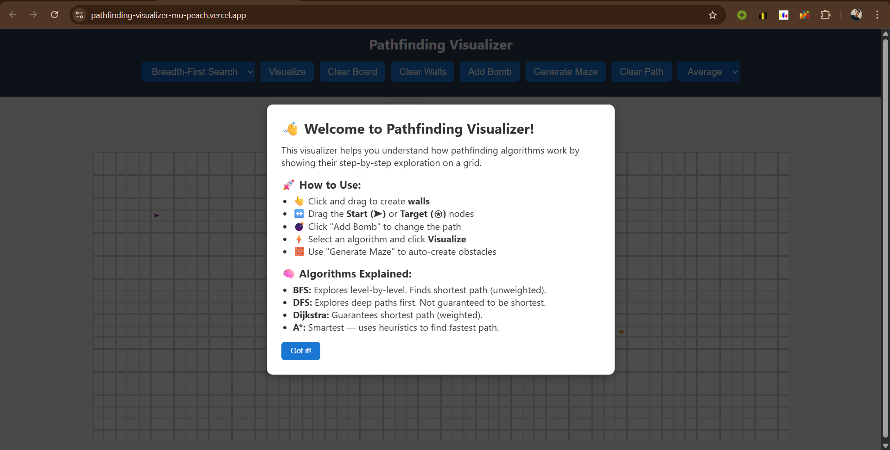
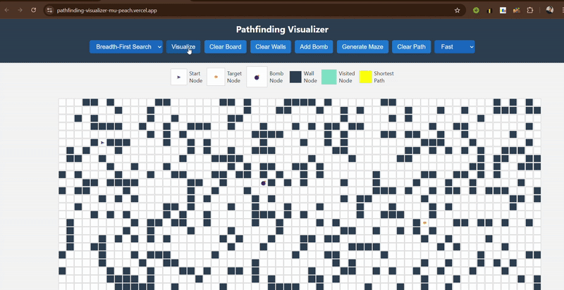

# 🧠 Pathfinding Visualizer

A fully interactive and beautifully designed **pathfinding algorithm visualizer** built using **HTML, CSS, and JavaScript** — no frameworks, no libraries.  
This tool helps you understand how algorithms like **BFS**, **DFS**, **Dijkstra**, and **A\*** explore and find the shortest path on a grid.

> 🔗 **Live Demo:** [https://pathfinding-visualizer-mu-peach.vercel.app/]  
> 🧰 Built with: HTML • CSS • JavaScript (ES6 Modules) • Vercel Hosting

---

## 🎯 Features

- ✅ Drag to place **walls (obstacles)** on the grid  
- ✅ Drag and reposition the **Start (➤)** and **Target (⍟)** nodes  
- ✅ Add a **Bomb node (💣)** to force a 2-phase path  
- ✅ Choose from **4 algorithms**: BFS, DFS, Dijkstra, A*  
- ✅ **Visual speed controls**: Fast / Average / Slow  
- ✅ **Clear board, clear path, clear walls** buttons  
- ✅ Random **maze generator** feature  
- ✅ Fully **responsive layout** for desktop and mobile  
- ✅ Instructional **modal popup** on first page load  
- ✅ **Symbol legend** for user guidance

---

## 📸 Screenshots

| Main UI                     | Pathfinding in Action         |
|-----------------------------|-------------------------------|
|      |  |

---

## 🧠 Algorithms Implemented

| Algorithm    | Description                                       | Shortest Path? |
|--------------|---------------------------------------------------|----------------|
| **BFS**      | Explores level-by-level (unweighted)              | ✅ Yes         |
| **DFS**      | Explores depth-first (can get lost in branches)   | ❌ No          |
| **Dijkstra** | Explores based on cumulative cost (weighted)      | ✅ Yes         |
| **A\***     | Uses cost + heuristic (smartest & fastest)        | ✅ Yes         |

---

## 🚀 How to Use

1. **Click and drag** anywhere to create walls (obstacles).  
2. **Move the Start (`➤`) and Target (`⍟`) nodes** by dragging.  
3. Click **“Add Bomb”** to place a bomb (`💣`) node.  
4. Select an algorithm and speed from the dropdowns.  
5. Click **Visualize** to watch the algorithm in action.  
6. Use **Clear**, **Maze**, and **Speed** controls as needed.  
7. Watch the final **shortest path** animate in yellow.  
8. A popup alert shows the **path length in steps**.

---

## 🗂️ Folder Structure

```
Pathfinding-Visualizer/
│
├── index.html               # Main HTML layout
├── styles.css               # Styling for grid, modal, legend, etc.
├── main.js                  # UI logic, grid creation, animation engine
│
├── algorithms/              # Individual JS modules for each algorithm
│   ├── bfs.js
│   ├── dfs.js
│   ├── dijkstra.js
│   └── astar.js
│
├── screenshots/             
└── README.md                # This file
```

---

## 🌐 Live Deployment

> This project is deployed on **Vercel** — optimized for static frontend sites

### 🔗 Live Site:  
[https://pathfinding-visualizer-mu-peach.vercel.app/]

### 📦 Hosted with:  
- GitHub for code  
- Vercel for live deployment

---

## 🛠 Tech Stack

| Tech         | Purpose                         |
|--------------|----------------------------------|
| **HTML**     | Layout and structure             |
| **CSS**      | Responsive design, styles        |
| **JavaScript** | UI logic & algorithm animations |
| **Vercel**   | Hosting + auto-deploy            |

---

## 🧑‍💻 Author

**Harsh**  
🔗 [LinkedIn](https://www.linkedin.com/in/rharsh9162/)  

---

## 💡 Future Improvements

- Add **step-by-step play/pause mode**  
- Show **visited node count** and **path cost**  
- Add **weighted walls / diagonal movement**  
- Add **recursive maze generation animation**  
- Export result path as **JSON or CSV**

---

## 📄 License

This project is open-source under the **MIT License** — free to use, share, or modify.

---

## ⭐ If You Liked This...

- Star ⭐ the repository  
- Share it with friends  
- Fork and build your own improvements  

---

### 🛠 Deploy it Yourself

[](https://vercel.com/)

---

